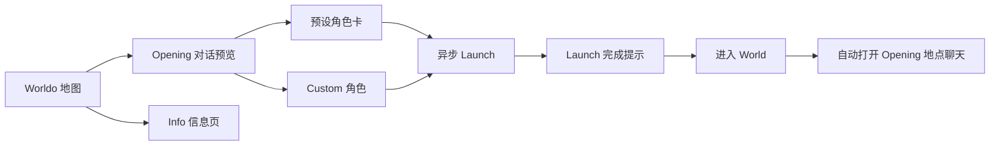

# `main_new_worldo` 分支 Worldo 与 Create/Edit 页面改动说明

## 1. 文档范围

本文梳理 `main_new_worldo` 分支中与以下页面和链路直接相关的改动：

- Worldo 详情页（代码中的 `OriginWorldPage`）
- Worldo Launch 与进入 World 的衔接
- Create Worldo 页面
- Edit Worldo 页面
- Create/Edit 共用的 Opening 编辑器、草稿模型和上传组件

对比基线为当前分支与 `main_ui` 的共同祖先：

- 基线提交：`b98c9431`
- 当前提交：`8c2c14fc`
- 相关提交：`67fe1b9c` 至 `8c2c14fc`（含首尾）

本说明不展开 iOS 工程配置、CocoaPods/SwiftPM 等与页面业务无直接关系的改动。

## 2. 总体改造目标

这轮修改的核心不是单一页面换肤，而是重新组织 Worldo 的浏览与启动路径：

1. 用户先在地图上理解空间。
2. 用户通过 Opening 对话快速理解故事开场。
3. 用户直接在详情页查看和选择角色。
4. Launch 异步完成后，将用户带入 Opening 对应地点的聊天页。
5. Create/Edit 增加 Opening 编辑能力，使创建侧的信息结构与消费侧的 Opening 展示概念一致。

整体链路如下：



---

## 3. Worldo 页面具体修改

### 3.1 顶部第二个 Tab 从 Location 改为 Info

原逻辑：

- 顶部为 `Map / Location (n)`。
- 第二个 Tab 展示地图地点列表。

新逻辑：

- 顶部改为 `Map / Info.`。
- 第二个 Tab 展示 Worldo 的完整介绍内容。
- 图标从地点图标切换为信息图标。
- Info 模式使用更宽的 Tab 文本间距。
- 埋点从 `worldo_detail_location_list` 调整为 `worldo_detail_intro`。

Info 页承接了原来底部详情 Sheet 中的大部分内容：

- Worldo 标题、作者和编辑入口
- copy / connect / character 统计
- World View
- Launch Preview
- Progress
- Discuss
- Characters

涉及文件：

- `lib/components/world_top_overlay_bar.dart`
- `lib/pages/origin/origin_world_page.dart`
- `lib/pages/origin/origin_world_detail_sheet.dart`

### 3.2 WorldMap 增加可注入的列表内容

`WorldMap` 新增 `pointsListBuilder`。

原先 `showPointsList = true` 时只能渲染固定的 `WorldLocationList`；现在调用方可以注入任意 Widget。Worldo 页面借此在复用地图组件的同时，把第二个 Tab 替换为 `_OriginIntroList`，而其他 World 页面仍可继续使用原地点列表。

策略：

- 不复制一套 WorldMap。
- 保留默认地点列表作为 fallback。
- 通过可选 builder 做页面级差异化。

这属于“共享组件扩展点”策略，降低了 Worldo 特例对其他地图页面的影响。

涉及文件：

- `lib/components/world_map.dart`
- `lib/pages/origin/origin_world_page.dart`

### 3.3 Info 页独立管理滚动和 Discuss 状态

原详情 Sheet 内的 Discuss controller、当前用户 UID 获取等逻辑，迁移到 `_OriginIntroList`。

具体处理：

- 每个 Origin 使用 `PageStorageKey('origin-intro-<oid>')` 保存滚动位置。
- Origin ID 变化时重新配置 Discuss loader 并刷新第一页。
- Info 页销毁时释放 `OriginDiscussListController`。
- Info/Map 切换时收起底部 Sheet，并把 Sheet 内部滚动位置重置到顶部。

策略：

- 将信息流自身的分页、UID 和滚动生命周期收敛在 Info 页。
- 避免底部角色 Sheet 与 Discuss 列表共用同一滚动控制器。
- 使用 Origin ID 作为页面状态隔离键，防止切换 Worldo 后串状态。

### 3.4 底部可拖动 Sheet 改为“Opening + 选角色”

原底部 Sheet 主要展示完整 Worldo 详情。

新底部 Sheet 内容改为：

1. Opening 初始对话预览。
2. `Select Your Role` 角色选择区域。
3. 底部预留 Launch 固定栏高度，避免内容被遮挡。

视觉调整：

- Sheet 背景改为 `#EDEDED`。
- 圆角保持统一的 `GenesisRadii.sheet`。
- Sheet 展开到状态栏区域时，状态栏背景渐变为 Sheet 背景色。
- 状态栏图标固定切换为深色。
- Sheet 的可用高度改为完整 viewport，不再预先扣除底部 Launch bar；内容末尾用 spacer 避让固定栏。

策略：

- 底部 Sheet 聚焦“立即理解 Opening 并启动”。
- 详细资料移到 Info Tab，降低首屏信息密度。
- 固定 Launch bar 和可拖动 Sheet 分层布局，保证主操作持续可见。

### 3.5 Opening 对话预览解析

Worldo 页新增 `_originFirstInitialDialoguePreview`，从正式 Origin detail 的 `ticks` 中解析 Opening，而不是从本地 Create 草稿读取。

解析规则：

- 只接受 Origin 实际地点列表中存在的 `location_id`。
- 优先读取 `tick_no = 1`。
- 若没有 tick 1，再按 tick 序号读取可用内容。
- 兼容 `tick_result.location_groups` 和顶层 `location_groups`。
- 对话字段兼容：
  - `initial_dialogue`
  - `initialDialogue`
  - `dialogue`
- 地点 ID 字段兼容：
  - `location_id`
  - `loc_id`
  - `id`
- 角色 ID 字段兼容：
  - `char_id`
  - `character_id`
  - `sender_id`
- 文本字段兼容 `content` 和 `text`。
- 空内容会被过滤。
- `char_id = nar` 且 `char_name = narrator` 时识别为 narrator。
- 有时间信息时，在消息首行插入 tick/time 消息。
- 通过 Origin 角色列表补全角色名和头像。
- 如果最终只有 tick/time、没有任何实际对话，则不展示 Opening 区域。

展示层复用 `ChatMessageRow` 和 `kLocationChatStyle`，使 Worldo 预览与真实 Location Chat 的消息结构保持一致。

涉及文件：

- `lib/pages/origin/origin_world_location_chat.dart`
- `lib/pages/origin/origin_world_sections.dart`

### 3.6 角色卡改造

详情 Sheet 新增横向角色卡列表，每张预设角色卡包含两种状态。

正面：

- 288 × 288 角色图。
- 渐变遮罩。
- 角色名称。
- Identity/tags 摘要。

背面：

- 角色名称。
- Identity。
- Brief。
- Goal。
- 内容过长时允许卡片内部滚动。

底部操作区：

- 使用角色图的模糊背景。
- 叠加 70% 黑色遮罩。
- 上半部分是展开/收起角色详情的 48 高点击区。
- 下半部分是 `Select to Launch`。
- Launch 过程中统一显示 `Launching...` 并禁止重复操作。

列表末尾增加一张 Custom 卡：

- 点击后直接打开已有角色选择 Sheet。
- 默认定位到 Custom Tab。
- 若后台加载到“已启动 World 的角色”，也不会覆盖用户明确指定的 Custom 初始 Tab。

列表底部增加页码圆点：

- 根据横向滚动 offset 和卡片步长计算当前索引。
- 当前点使用品牌色并放大。
- 加入 Semantics 文本，便于无障碍识别当前页。

涉及文件：

- `lib/pages/origin/origin_world_sections.dart`
- `lib/components/origin/origin_role_launch_sheet.dart`

### 3.7 角色图片加载策略

角色卡图片统一按 288 × 288 的逻辑尺寸和设备 DPR 调用 `selectGenesisImageUrl`，选择合适的 OSS 图片阶梯。

页面拿到 Origin detail 后会提前缓存：

- Launch 等待弹层所需头像。
- 角色卡所需头像。

加载失败时：

- 网络图回退到 `GenesisAvatarFallback`。
- asset 图加载失败也回退。
- 缓存失败只记录 debug log，不阻塞页面和 Launch。

策略：

- 根据实际显示尺寸取图，避免直接下载过大原图。
- 提前缓存首屏角色卡，减少横向滑动时闪烁。
- 预加载失败不影响核心业务链路。

### 3.8 底部固定 Launch 栏调整

原固定栏左侧展示 copy / connect / character 统计。

新固定栏：

- 左侧展示 Worldo 名称，使用 `originDisplayName`，确保 `#` 规则统一。
- 右侧保留 140 × 35 的 Launch 按钮。
- 背景改为半透明 `#EDEDED` 并增加 16 sigma 的背景模糊。
- 统计信息移入 Info 页标题区域。

策略：

- 固定栏只保留“当前对象是谁”和“主操作是什么”。
- 降低底栏信息密度，统计信息归入 Info。

### 3.9 三种 Launch 入口

当前页面存在三种入口：

| 入口 | 行为 |
| --- | --- |
| 预设角色卡 | 登录校验后直接用该角色 Launch |
| Custom 卡 | 打开 Launch Sheet，并直接定位 Custom Tab |
| 底部 Launch 按钮 | 打开完整 Launch Sheet，沿用预设/Custom/已启动 World 角色选择 |

预设角色卡使用单独埋点：

- action：`worldo_setup_role_launch`
- object1：Origin ID
- object2：角色稳定 ID

### 3.10 Launch 后自动进入 Opening 地点聊天

预设角色直接 Launch 时，会把 Opening 预览对应的 `locationId` 传入异步 Launch 链路。

传递路径：

```text
OriginWorldPage
  -> startOriginLaunch(initialLocationId)
  -> OriginLaunchCoordinator.start
  -> OriginLaunchPendingStore
  -> Launch 完成弹窗
  -> RouteNames.world / initial_location_id
  -> WorldPage
  -> 自动打开对应 Location Chat
```

具体策略：

- `initialLocationId` 写入 `SharedPreferences`，因此页面退出或 App 重建后仍能恢复。
- Launch 成功、超时但已创建 World 两种完成出口都会保留该地点 ID。
- 路由同时兼容：
  - `initial_location_id`
  - `initialLocationId`
- `WorldPage` 不会在数据和聊天室未就绪时立即打开聊天。
- 只有 relation status 允许建立 World Chatroom 时才继续。
- 地点查找先按 descriptor 主 ID 匹配，再检查 `localMessageLocationIds`，兼容父子地点或消息实际落点。
- 聊天页通过 post-frame callback 打开，避免在当前 build 阶段导航/弹层。
- 尝试一次后清空 pending ID，避免重复弹出。

涉及文件：

- `lib/pages/origin/origin_launch_flow.dart`
- `lib/pages/origin/origin_launch_coordinator.dart`
- `lib/pages/origin/origin_launch_pending_store.dart`
- `lib/pages/world/world_page.dart`
- `lib/routers/app_router.dart`

---

## 4. Create/Edit 页面具体修改

### 4.1 新增 Opening Section

Create 与 Edit 的总览页都新增 `Opening` 条目，并增加独立 SVG 图标。

页面顺序：

1. Basics
2. Characters
3. Locations
4. Opening
5. Story Events

涉及文件：

- `assets/custom-icons/svg/create_origin_opening.svg`
- `lib/icons/custom_icon_assets.dart`
- `lib/pages/create/create_origin_page.dart`
- `lib/pages/create/create_opening_page.dart`
- `lib/pages/edit/edit_origin_page.dart`
- `lib/pages/edit/edit_opening_page.dart`
- `lib/pages/origin_editor/origin_editor_pages.dart`

### 4.2 Locations 从可选改为必填，并升级为 L1/L2/L3 树

总览文案从：

```text
Locations (Optional)
```

改为：

```text
Locations (>=1)
```

校验变化：

- Locations Section 必须保存。
- Create 和 Edit 都使用树形 Locations 编辑器。
- 至少需要一个 L1；每个 L1 至少包含一个 L2；每个 L2 至少包含一个 L3。
- L1、L2、L3 的 Name 均为必填。
- 新增 L1 时自动创建一个 L2 和一个 L3。
- 新增 L2 时自动创建一个 L3。
- 数量上限 `10` 只统计 L3，L1 和 L2 不计入上限。

策略原因：

- Opening 必须绑定一个初始地点。
- 因此 Locations 必须先于 Opening 建立稳定的数据依赖。
- L1/L2 由用户直接维护，替代“先平级填写，再由 LLM 整理层级”的旧交互。

#### 4.2.1 各层级的编辑内容

| 层级 | 可编辑内容 |
| --- | --- |
| L1 | Name |
| L2 | Name |
| L3 | Image、Name、Initial Characters |

Location 卡片中的 Description 已从 Create/Edit UI 删除。

为避免 Edit 旧数据丢失，旧 L3 的 Description 仍保留在内存表单和 payload 中，并在用户保存时原样带回；当前客户端只是不再提供编辑入口。

#### 4.2.2 层级编号

页面按当前显示顺序生成仅供用户理解层级关系的编号：

- L1：`Loc_n`
- L2：`Loc_n_n`
- L3：`Loc_n_n_n`

每个标题和 `+ Add L1/L2/L3 Location` 后都会显示对应 `(ID: ...)`。该编号表达的是当前页面排序和归属关系，不等同于后端最终存储 ID；已有 L3 的真实 `location_id` 会继续保留。

#### 4.2.3 树形视觉

- L2 相对 L1 缩进 `12px`。
- L3 相对 L1 缩进 `24px`。
- 左侧竖线和分支线使用 `#338960`、60% 不透明度，即 `0x99338960`。
- 不显示横向分割线。
- 原分割线位置保留 `8px` 垂直空隙，树线穿过空隙保持连续。
- L1/L2/L3 内容区上下各 `8px`；相邻 L3 之间再有 `8px` 外部间距，因此相邻内容的视觉间距为 `24px`。
- L3 取消卡片边框与卡片左右内边距，使用缩进后的完整可用宽度。
- L1/L2 的 `Name` 与输入框同行，横向间距 `8px`。
- 25 字字符计数放在输入框内部右侧。
- Initial Characters 单行高度与 Name 输入框一致，不再由右侧添加按钮撑高。

#### 4.2.4 删除、保存与错误反馈

不能删除最后一个必需节点时，删除按钮显示为禁用状态；点击后仍会用英文 toast 解释原因：

```text
At least one L1 location is required.
Each L1 location must contain at least one L2 location.
Each L2 location must contain at least one L3 location.
```

Save 只有在整棵树满足必填规则时才可用。点击禁用的 Save 会显示第一个具体问题，例如：

```text
L1 1: Location Name is required.
L2 1.1: Location Name is required.
L3 1.1.1: Location Name is required.
```

#### 4.2.5 Edit 旧数据兼容

Edit Locations 同样启用树模式。`/api/v1/origin/foredit` 返回的数据会按 `level` 和 `location_pid` 尽量重建 L1/L2/L3：

- 完整父子关系按原结构恢复。
- 缺少父层级的 L2 会挂到一个空白 L1 下。
- 缺少父层级或旧版平级的 L3 会挂到空白 L1/L2 下。
- 旧 L3 的 Name、Image、Initial Characters、Description 和真实 `location_id` 均保留。
- 自动补出的空白 L1/L2 必须由用户填写后，Locations 才能保存。
- 用户没有进入并保存 Locations 时，Edit 内存仓库仍保留接口返回的原始地点数据。

### 4.3 Opening 草稿模型

`CreateOriginDraft` 新增：

```text
opening: OpeningDraft
openingSaved: bool
```

`OpeningDraft` 字段：

```text
locationId
locationName
dialogue[]
```

每条 `OpeningDialogueDraft` 字段：

```text
type
content
characterId（仅 character 类型需要）
```

支持的类型：

- `narrator`
- `character`
- `image`

完成条件：

- 已选择 location。
- 至少有一条 dialogue。
- 每条 dialogue 都有非空 content。
- character 类型必须存在 characterId。

草稿 JSON 新增：

- `opening`
- `opening_saved`

旧草稿没有这两个字段时会回退到空 Opening 和 `openingSaved = false`，不会导致反序列化失败。

涉及文件：

- `lib/pages/create/create_origin_draft_store.dart`

### 4.4 Create/Edit 提交前校验

Create 和 Edit 当前必填 Section：

- Basics
- Characters
- Locations
- Opening

Story Events 仍为可选。

Opening 还会进行跨 Section 引用校验：

- `opening.locationId` 必须仍存在于当前 L3 Locations。
- character dialogue 引用的 `characterId` 必须仍存在于当前 Characters。
- 任意对话内容为空都会阻止提交。

Locations 的提交校验不只判断 `locationsSaved == true`，还会检查：

- 至少存在一个 L3。
- 所有有内容的 L1/L2/L3 都有 Name。
- Opening 选中的 Location 仍是有效 L3。

Characters 同样不只判断 `charactersSaved`：

- 至少存在一个角色。
- 每个已填写角色的 Name、Identity、Personality 都完整。

Basics 继续校验 Worldo Name、Worldo Brief、Cover Image，以及可选 Metric JSON 的合法性。

策略：

- 在客户端提交前拦截悬空地点和悬空角色引用。
- 防止用户保存 Opening 后又删除关联地点或角色，产生不可恢复的数据。

### 4.5 Opening 编辑器

Create 和 Edit 共用 `OriginOpeningEditorPage`，仅 repository 不同：

- Create：`CreateOriginDraftRepository`
- Edit：`MemoryOriginDraftRepository`

#### 4.5.1 初始地点选择

地点候选只来自已保存、名称非空且 `level == 3` 的 Locations；L1/L2 不会出现在 Opening 的选择弹窗中。

每个候选地点展示：

- 标准 Location 图标和地点名称。
- 如果存在 Initial Character，再显示标准 AI Character 图标和角色名称；角色名使用 `#666666`。

选择地点后：

- 页面展示该地点的初始角色。
- character 类型的新增按钮只展示这些初始角色。

如果切换地点时已有对话内容：

- 先弹出确认框。
- 标题为 `Switching locations will clear the dialogue content.`，行高使用标准弹窗的 `1.4`。
- 操作为 `Continue` 和 `Cancel`。
- 用户继续并选中不同地点后才清空原对话。

策略：

- Opening 对话角色受初始地点角色集合约束。
- 地点切换后不尝试静默迁移旧对话，避免角色引用错位。

#### 4.5.2 对话编辑

用户可以按任意顺序追加：

- Narrator 文本
- 指定 Character 文本
- Image

每条内容：

- 有独立稳定的页面内 ID。
- 可以单独删除。
- 保存时严格保持当前列表顺序。

视觉复用真实聊天 UI：

- Narrator 使用 system message 样式。
- Character 使用头像、角色名和聊天气泡。
- Image 使用上传卡片。

文本输入：

- 3～7 行。
- 支持换行。
- Save 按钮只有在全部条目完整时才可用。

页面和控件细节：

- 标题为 `Select initial location` 和 `Opening dialogue`，均为 `16px / w600`。
- Select initial location 输入框高度为 `40px`，与普通单行输入框一致。
- 未选择地点时显示统一注释：`Select a location first, then edit the dialogue.`
- Add 区第一行显示可用角色，第二行显示 Narrator 和 Image；每个按钮保留 `+`，并显示对应图标。
- Character 与 Narrator 复用 Location Chat 的气泡视觉。
- Opening 页不额外给 AI Character 图标添加红星。
- Image 默认上传框为正方形；选择后原图直传、不裁剪，并按真实比例预览。
- Image 宽度和左右间距与 Narrator 内容区一致。
- 每个 dialogue 模块都使用统一删除按钮；Opening Image 的删除按钮保留模块右上角部分外伸的布局。
- 拖动页面或点击非输入区域会收起键盘。

Save 的完整条件：

1. 已选择 Initial Location。
2. 至少添加一个 dialogue item。
3. 每个已添加的 Narrator/Character 文本都非空。
4. 每个已添加的 Image 都已完成上传。

#### 4.5.3 恢复策略

重新进入 Opening 页面时：

- 只有 `openingSaved = true` 且地点仍存在时才恢复选中地点。
- 未知 dialogue type 会跳过。
- character 类型引用已删除角色时会跳过该条。
- 有效条目按原顺序恢复。

这是“容错恢复”策略：优先保证编辑页可打开，不让失效引用导致整个草稿无法加载。

### 4.6 图片上传组件扩展

`CreateUploadBox` 新增两个可选能力：

- `uploadOriginalImage`
- `preserveImageAspectRatio`

Opening Image 使用：

- 原图直传，不进入固定比例裁剪页。
- 解码图片宽高并按原始宽高比展示。
- 上传过程继续使用统一进度层。

其他 Create/Edit 图片入口统一取消底部红色 `Remove` 文案，改用 `CreateFormDeleteButton`：

- 删除按钮位于图片框内部右上角。
- 顶部和右侧均留 `4px`。
- Opening dialogue Image 是唯一保留“向外伸出一部分”布局的例外。
- 上传中删除或再次选择图片会提示 `Image upload is in progress.`。

失败回滚：

- 选择新图前记录旧 URL。
- 上传失败时清除本次 preview。
- 恢复旧 URL。
- 展示统一 toast。

其他 Create/Edit 图片入口默认不开启这两个选项，因此继续沿用原裁剪流程。

策略：

- 用可选参数扩展共享上传组件，不改变既有 cover/avatar/location 图片行为。
- Opening Image 保留原始画面比例，适合叙事插图而非固定头像/封面裁剪。

涉及文件：

- `lib/pages/create/create_form_widgets.dart`

### 4.7 Create/Edit 共用实现和变更检测

Basics、Characters、Locations、Opening、Story Events 都由 `lib/pages/origin_editor/` 下的共享页面实现，通过 `OriginDraftRepository` 接入两种场景：

- Create：`CreateOriginDraftRepository`
- Edit：`MemoryOriginDraftRepository`

Create/Edit 外层页面只负责传入 repository 和流程参数。后续对这些编辑页做 UI 或校验调整时，应优先修改共享实现，避免 Create/Edit 再次分叉。

Edit 的内存 repository 增加：

- `openingChanged`
- Opening 纳入 `originDraftContentEquals`

因此：

- Opening 修改可以在 Edit 总览显示 modified 状态。
- Opening 内容变化会被视为“存在待发布修改”。

同时 `_SectionRow` 做了通用化：

- 支持外部 key。
- icon 可为空。
- onTap 可为空。
- 不可点击时隐藏右侧箭头。

### 4.8 Opening 总览摘要

Create/Edit 总览中的 Opening 摘要固定为两行：

1. Initial Location Name。
2. `Character dialogue*N, Narrator*N, Image*N`。

计数为 `0` 的类型不显示，保留类型顺序。

示例：

```text
Nathan's Cafe
Character dialogue*2, Image*1
```

### 4.9 Characters、Locations、Story Events 统一样式

这些编辑页已对齐为同一套表达：

- 页面最宽内容距屏幕左右各 `12px`。
- Characters、L3 Locations、Story Events 卡片均取消外框和卡片左右内边距。
- 卡片内部上下各 `8px`。
- Characters 和 Story Events 的相邻卡片之间额外增加 `8px`，视觉内容间距为 `24px`。
- Character 卡片的字段子标题统一为 `w400`。
- `+ Add Character` 和 `+ Add Event` 使用 `16px / w600 / #338960`，整体水平居中。
- Location 各级 Add 使用 `14px / w600 / #338960`，按对应层级左对齐，并显示待新增节点的 `(ID: ...)`。

Opening 页的标题和普通字段区域通过额外 `2px` 内边距达到左右各 `12px`；Dialogue 气泡区域继续保持 Location Chat 对齐所需的左右各 `10px`，不随外层统一间距改变。

### 4.10 禁用操作仍提供原因

`GenesisPrimaryButton`/表单按钮支持 `onDisabledPressed`。按钮视觉上仍为禁用，但点击后会显示英文原因，而不是无反馈。

已覆盖的主要场景：

- Basics、Characters、Locations、Opening、Story Events 的 Save。
- Create/Publish 总操作按钮。
- Locations 中不能删除的最后一个必需节点。
- Opening 地点尚未加载、未选择 Location 时的 Add。
- 图片上传中的删除或再次上传。
- 正在保存、创建或发布中的重复操作。

禁用按钮的埋点仍记录为 `enabled: false`，不会被当作真实提交。

---

## 5. 当前 API 策略与明确边界

这一部分是本分支当前实现中最需要注意的地方。

### 5.1 Opening 当前只进入本地草稿，不进入正式 Create/Update 请求

虽然以下能力已经完成：

- Opening UI
- 本地草稿序列化
- 必填状态
- 完整性校验
- 地点/角色引用校验
- Edit 变更检测

但 `CreateOriginDraft.toCreateOriginPayload()` 当前没有写入 `opening`。

Create 和 Edit 最终都以该 payload 为基础，因此：

- `/api/v1/origin/create` 不发送 `opening`
- `/api/v1/origin/update` 不发送 `opening`

测试中也明确断言 Create 请求体不包含 `opening`，说明这是当前分支被保留的接口边界，而不是遗漏在测试之外的隐式行为。

### 5.2 Edit 不会从接口回填已有 Opening

`originDraftFromV1Detail()` 当前没有从 `/api/v1/origin/foredit` 解析 Opening：

- Edit 打开后 `opening` 默认为空。
- `openingSaved` 默认为 false。
- 用户要发布其他编辑内容时，会被要求先完成并保存 Opening。

### 5.3 Location 树字段已进入客户端 payload，但后端契约尚未升级

客户端 `location_list` 当前会携带：

```text
location_id
location_pid
level
name
image
description
initial_character_ids
```

其中：

- 新 UI 会提交 L1、L2、L3 全部节点。
- L1/L2 只填写 Name；Image、Description 和 Initial Characters 为空。
- L3 提交 Image、Name 和 Initial Characters。
- Description 虽已从 UI 移除，但 Edit 旧数据会继续原样带回，防止客户端主动清空历史值。

由于后端 Create/Update/Foredit API 尚未完成对应升级：

- 不能假设新建后一定能完整存储 `level` 和 `location_pid`。
- 不能假设 Edit 一定能读回完整父子树。
- Edit 会尽量按返回字段恢复；读不到的 L1/L2 先显示为空白必填父节点。

### 5.4 由此产生的实际风险

1. 用户在 Create/Edit 中编辑的 Opening 不会提交到后端。
2. Edit 无法展示或修改服务端已有 Opening。
3. Opening 虽然能触发 Edit 的 modified 状态，但 Publish 请求不会包含其内容。
4. Worldo 详情页展示的 Opening 来自后端 `ticks.location_groups.initial_dialogue`，与本地 Opening 草稿尚未形成提交闭环。
5. 新 Location 层级在后端升级前可能无法完整回读，Edit 会要求用户补全缺失的 L1/L2 Name。

### 5.5 后续联调建议

在后端字段契约明确后，需要补齐：

1. Create 请求中的 Opening 映射。
2. Update 请求中的 Opening 映射。
3. `/origin/foredit` 到 `OpeningDraft` 的反向映射。
4. 图片类型的正式字段名和资源结构。
5. narrator/character/image 顺序及 character ID 的接口契约测试。
6. 旧 Origin 没有 Opening 时，Edit 是否强制补录的产品规则。
7. Location L1/L2/L3 的创建、更新、删除和稳定排序契约。
8. `/origin/foredit` 必须稳定返回 `location_id`、`location_pid`、`level` 和旧 Description。

在这些工作完成前：

- Opening 应视为“前端编辑能力已搭建、正式数据闭环未接通”。
- Location Tree 应视为“客户端已完成编辑与 payload 映射，服务端持久化和回填仍待联调”。

---

## 6. 其他交互与可用性调整

### 6.1 点击空白区域收起键盘

`CreateKeyboardDismissArea` 从空包装改为透明点击手势，点击表单空白区域时会主动 unfocus。

### 6.2 删除按钮统一

新增 `CreateFormDeleteButton`：

- 统一 24 × 24 尺寸。
- 统一浅灰背景、边框和图标颜色。
- 默认图标大小 `14px`。
- 禁用时整体不透明度为 `0.45`。
- Create/Edit 卡片、图片预览和 Opening dialogue 共用。

### 6.3 页面滚动和键盘

所有编辑页外层使用 `CreateKeyboardDismissArea`；滚动表单时也设置 `ScrollViewKeyboardDismissBehavior.onDrag`。因此：

- 点击非输入区域会收起键盘。
- 拖动页面会收起键盘。
- 键盘显示时隐藏底部吸底 Save 操作栏，避免遮挡输入。

### 6.4 通用弹窗标题行高

`GenesisActionBox` 标题行高从 `1.16` 调整为 `1.4`，避免 Opening 的长确认提示拥挤或裁切。

---

## 7. 主要测试覆盖

本分支新增或调整的测试主要覆盖：

### Worldo

- Map/Info Tab 与 Info 页面布局。
- 底部 Sheet 的滚动、收起和背景样式。
- Opening 对话优先取 tick 1。
- 多条 dialogue 保序、空内容过滤。
- narrator/character 类型转换。
- 角色头像解析。
- 角色卡尺寸、正反面切换、内部滚动和页码圆点。
- Custom 卡直接打开 Custom Tab。
- 预设角色直接 Launch。
- `initialLocationId` 写入 pending store。
- Launch 完成后路由携带初始地点。
- WorldPage 自动打开对应 Location Chat。

### Create/Edit

- Create/Edit 共用树形 Locations 编辑器。
- L1/L2/L3 自动补子节点、层级 ID、L3 数量上限和必填校验。
- Edit 完整树、旧版平级 L3、缺失父节点和孤立 L2 的恢复。
- Locations 最后一个必需节点禁用删除及原因 toast。
- Location Description 不再显示，但 Edit 旧值保存时不丢失。
- Opening 必填与完整性校验。
- Opening 地点选择及初始角色展示。
- Opening 地点选择只包含 L3。
- Narrator/Character/Image 的新增、删除和顺序。
- 切换地点前的清空确认。
- Opening 保存和重新进入恢复。
- Opening 两行摘要及零计数隐藏。
- 草稿 JSON round trip。
- Edit 打开 Opening。
- Edit Opening 变更检测。
- Characters/Locations/Story Events 的无边框布局、统一间距和 Add 样式。
- 图片统一删除按钮、上传中禁用反馈。
- 各 Section Save 及 Create/Publish 禁用原因反馈。
- Create 请求当前不包含 `opening` 的接口边界。

主要测试文件：

- `test/widget_test.dart`
- `test/pages/origin/origin_world_page_test.dart`
- `test/pages/origin/origin_launch_coordinator_test.dart`
- `test/components/world_map_stage_test.dart`

---

## 8. 关键文件索引

| 模块 | 文件 |
| --- | --- |
| Worldo 页面主状态与 Launch 入口 | `lib/pages/origin/origin_world_page.dart` |
| 地图/Info/底栏布局 | `lib/pages/origin/origin_world_map_shell.dart` |
| 可拖动 Sheet 与 Info 列表 | `lib/pages/origin/origin_world_detail_sheet.dart` |
| Opening、角色卡、Info Sections | `lib/pages/origin/origin_world_sections.dart` |
| Opening 数据解析 | `lib/pages/origin/origin_world_location_chat.dart` |
| WorldMap 注入扩展点 | `lib/components/world_map.dart` |
| 顶部 Map/Info Tab | `lib/components/world_top_overlay_bar.dart` |
| 角色 Launch Sheet | `lib/components/origin/origin_role_launch_sheet.dart` |
| 异步 Launch 状态 | `lib/pages/origin/origin_launch_coordinator.dart` |
| Launch 持久化 | `lib/pages/origin/origin_launch_pending_store.dart` |
| Launch 后自动开地点聊天 | `lib/pages/world/world_page.dart` |
| Create/Edit 总览 | `lib/pages/origin_editor/origin_editor_pages.dart` |
| Basics 共享编辑页 | `lib/pages/origin_editor/origin_basics_editor_page.dart` |
| Characters 共享编辑页 | `lib/pages/origin_editor/origin_characters_editor_page.dart` |
| Locations 树形编辑页 | `lib/pages/origin_editor/origin_locations_editor_page.dart` |
| Opening 编辑器 | `lib/pages/origin_editor/origin_opening_editor_page.dart` |
| Story Events 共享编辑页 | `lib/pages/origin_editor/origin_story_events_editor_page.dart` |
| 草稿与校验 | `lib/pages/create/create_origin_draft_store.dart` |
| 通用表单、上传、删除和 Add 组件 | `lib/pages/create/create_form_widgets.dart` |
| Edit API 回填与变更检测 | `lib/pages/origin_editor/origin_draft_repository.dart` |
| Edit Locations 树模式入口 | `lib/pages/edit/edit_locations_page.dart` |
