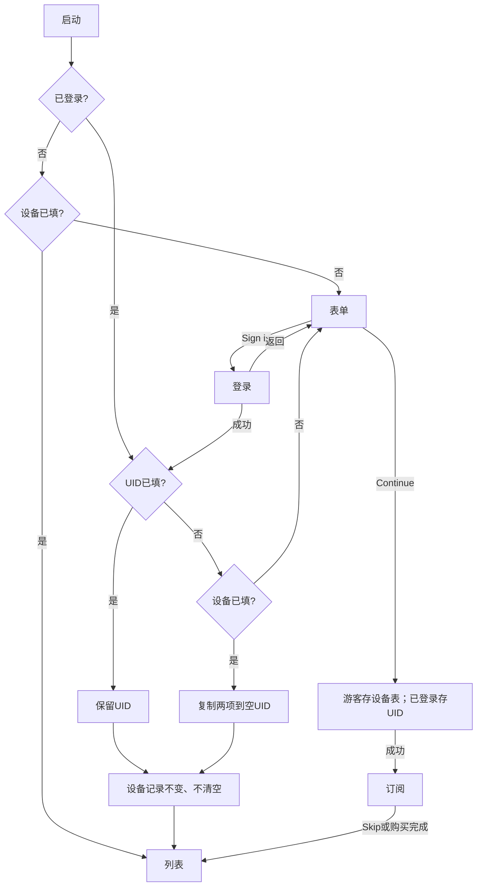

# 新用户引导需求

前端Demo，待接后端。

## 流程

## 规则与接口
- Gender：Male/Female/Non_binary；Age：18-24/25-34/35-44/45+。均必选；缺项提示，不可关闭或跳过。
- 设备两项落表，已填不再拦截。UID有值保留，空才复制；设备原值和完成状态不变。两边均空才回表单，隐藏登录链接。
- 保存成功进订阅，失败保留草稿重试；复制幂等且确认UID仍为空。Gender或身份变化刷新列表。
- 权益由后端返回，8条仅Demo。无Buy Gems；Skip保留资料。复用支付、游客登录及claim。
- 会员商品接口 `GET /api/v1/membership/products?provider=google|apple` 返回 `list`，不再返回 `vip_status`；登录账号会员状态统一读取全局 wallet。
- 新增设备读写及复制；扩展用户资料、推荐接口。

## 截图标注
逻辑以本文为准。

## 公共组件
复用 GenesisActionSheetHeader/Body、LoginProviderButtons、ProSubscriptionContent、showGenesisToast。细节见代码。
