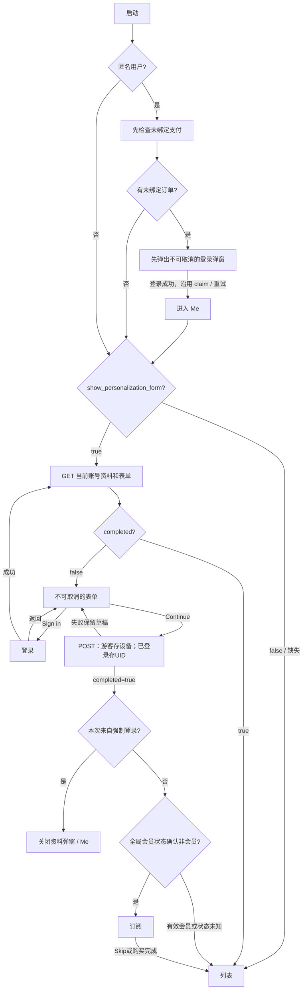
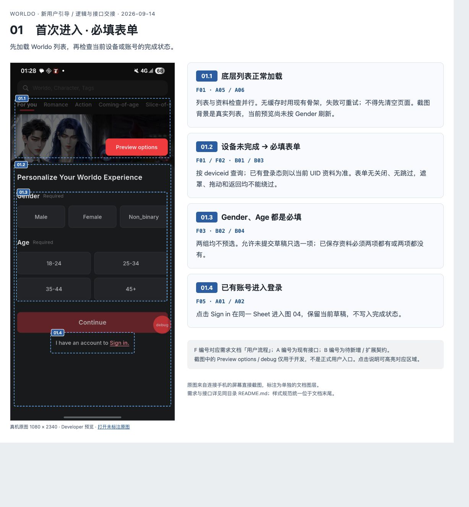
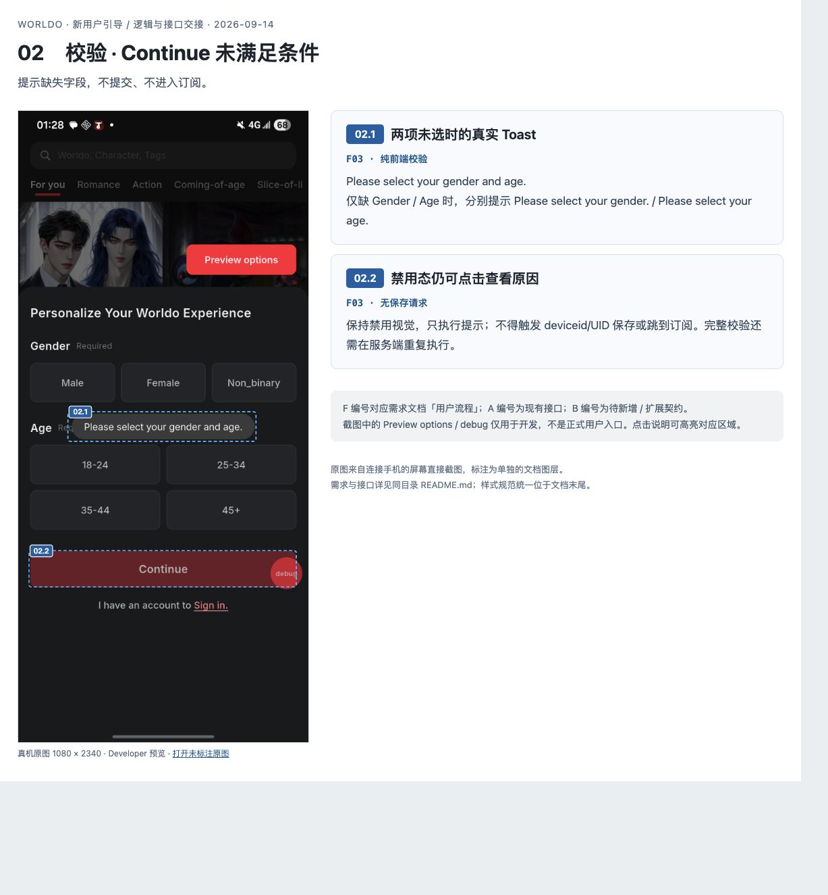
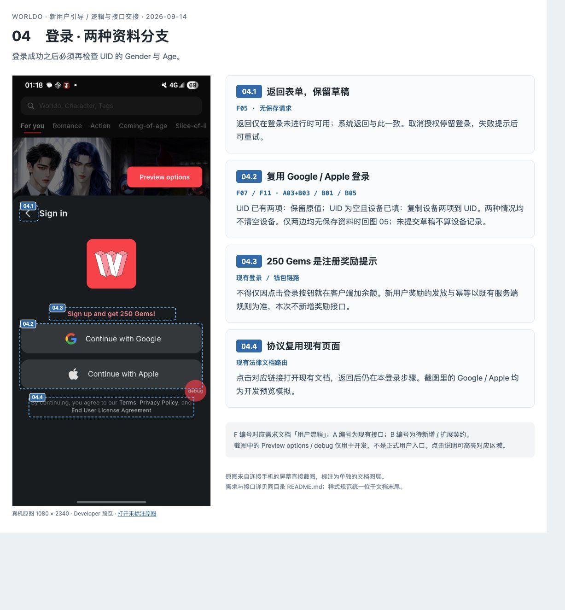
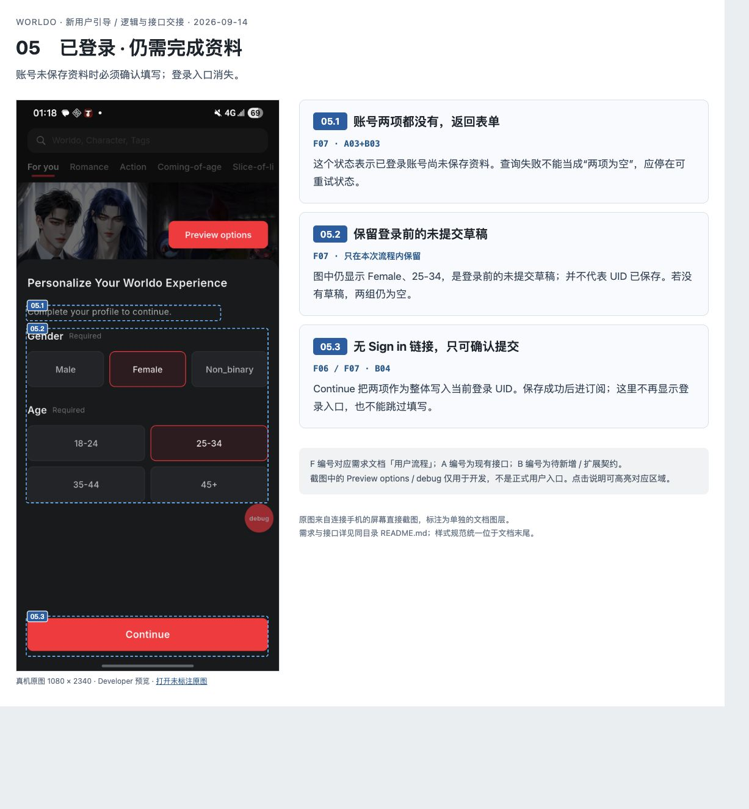
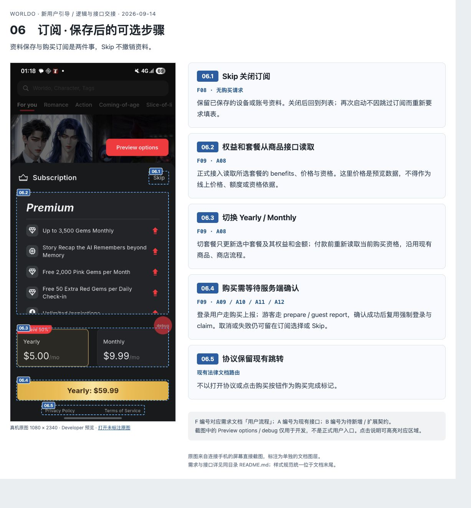
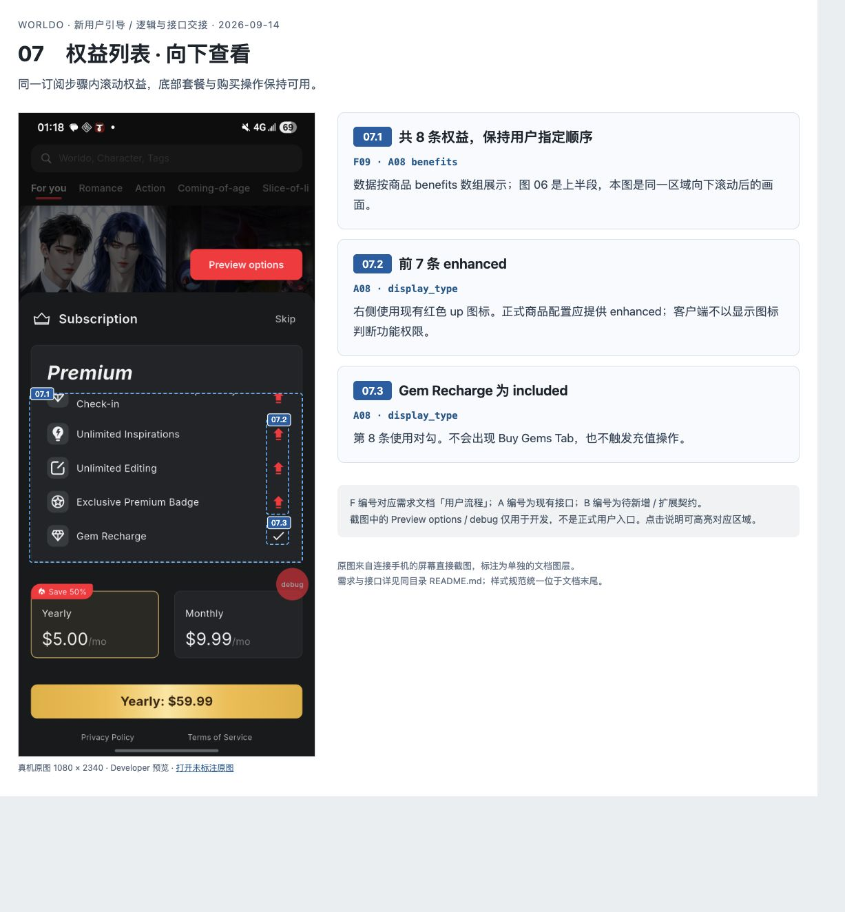
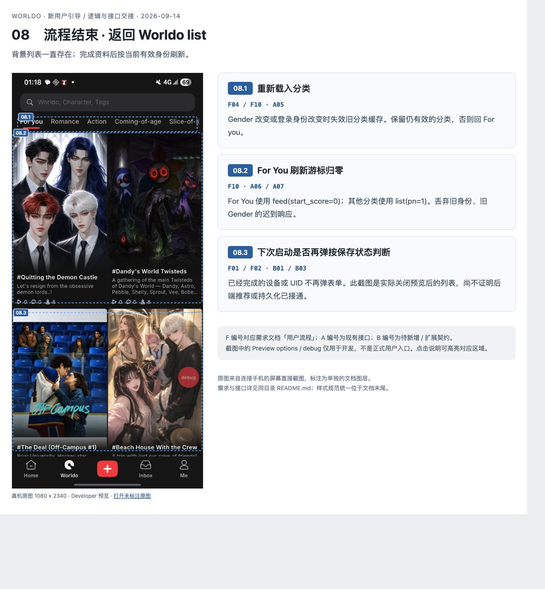

# 新用户引导需求

已接入 `GET/POST /api/v1/device/personalization`；下方截图为原 Developer 预览，正式入口由 config 的 `show_personalization_form` 开关及资料接口的 `completed` 决定。

## 流程

## 规则与接口
- 启动身份与未绑定支付登录检查完成后，商品预加载与 `GET personalization` 并行，不等待商品返回才展示表单。填表开关关闭时仍预加载商品，Home 与填表后的 Subscription 共用进行中的请求或 1 分钟内有效结果；具体缓存及失效规则见 [会员状态说明](../membership-access.md#商品预加载)。
- `GET /api/v1/app/config` 的 `data.show_personalization_form` 为 boolean，客户端默认 `false`。启动时仅成功获取 boolean `true` 才按当前身份查询资料及 `completed`；获取失败、字段缺失、`null` 或类型错误均保持关闭。关闭时不请求资料、不弹表单，也不因资料未填写阻塞其他弹窗。切换账号、前台恢复和资料请求失败重试都遵守该开关，不额外请求 config。
- 开关只控制填表入口，不控制 Continue 后的订阅引导。已展开的表单、登录及购买流程继续完成；下一次进入时应用最新配置。没有单独的订阅引导配置项。
- Gender、Age 的选项数量、顺序、value、label 从 `form` 数组读取；显示 label、提交 value，不使用本地枚举作为正式选项。保留原 item 样式、Gender 三列 / Age 两列及大字号适配，任意数量自动换行并滚动。
- 已登录读取本人资料，未登录读取设备资料；GET 不复制、不写入。只依赖服务端 completed，登录后重新读取当前 UID，未完成则回到原表单，隐藏登录链接；不把游客完成状态当成 UID 完成状态。
- 两项均必选，表单禁止遮罩关闭、下滑关闭和系统返回退出。POST 成功且 completed=true 才能继续；失败保留草稿，防重复提交。
- 匿名启动先等待未绑定支付检查；有未绑定订单时，先显示原强制登录弹窗，登录完成前不查询或展示游客资料表单。登录取消或失败仍停留在登录弹窗，成功后才读取当前账号资料，按 completed 决定是否补填。独立 VIP 登录 Gate 与普通签到在这段流程中保持阻塞，避免叠加弹窗。
- Continue 保存当前身份资料，不再发起未绑定支付检查。来自强制登录的用户补填成功后关闭资料弹窗，停留在 Me；其他用户复用全局 `membership.checkVip` 判断，有效 VIP 直接关闭，仅确认非会员才进入 Subscription。状态未知或查询失败时也关闭已保存的资料弹窗，避免向已有会员重复推荐订阅；正在刷新的 wallet 会等待当前请求。强制登录成功仍沿用原 VIP claim 与退避重试，不等待 claim 完成才允许补填。
- 后台重试后才发现未绑定订单时，未展示资料表单则先登录；已展示时在同一弹窗切到不可取消的 Sign in，保留草稿，不叠加第二个登录弹窗。登录后点击 Continue 不会再次进入强制登录步骤。
- GET 失败保留未知状态，不伪造完成或本地默认选项；前台按 2/4/8/16/32 秒间隔重试，切换账号丢弃旧结果。每次新启动重新 GET，完成状态保存在服务端。
- 权益使用正式会员商品接口。无 Buy Gems；Skip 保留已保存资料。复用原支付、游客登录及 claim，正式流程没有 Preview options。
- 会员商品接口 `GET /api/v1/membership/products?provider=google|apple` 返回 `list`，不再返回 `vip_status`；登录账号会员状态统一读取全局 wallet。
- 接口文档：[当前身份资料与表单](https://app.apifox.com/link/project/8297783/apis/api-514752401)。

## 截图标注
逻辑以本文为准。

## 公共组件
复用 GenesisActionSheetHeader/Body、LoginProviderButtons、ProSubscriptionContent、showGenesisToast。细节见代码。
